# A. 请求透传链路（端到端业务流）

> 视角：一条用户 `/v1/*` 请求从客户端进入 SafetyHub，到最终回到客户端的完整链路。
> 对应代码：`main.py`、`proxy/relay.py`、`middleware/*.py`、`runtime/upstream_client.py`、`proxy/stream.py`。

```mermaid
flowchart TD
    Client["客户端<br/>(OpenClaw / Hermes / 标注 Agent / SDK)"]
    Nginx["内网 Nginx<br/>llm-safetyhub.nanfu.com:80<br/>proxy_buffering off (SSE 透传)"]

    Client -->|"POST /v1/chat/completions<br/>Authorization: Bearer sk-*"| Nginx
    Nginx -->|"X-Request-ID 注入"| MW

    subgraph SafetyHub["SafetyHub 容器 (FastAPI + uvicorn, 4 worker)"]
        direction TB
        MW["中间件链 (按注册逆序执行)"]
        MW --> M1["RequestIdMiddleware<br/>生成/透传 X-Request-ID"]
        M1 --> M2["V1ConcurrencyLimitMiddleware<br/>仅拦截 /v1/*<br/>in-flight 信号量 + 排队队列<br/>队列满/超时 → 429"]
        M2 --> M3["RequestBodyLimitMiddleware<br/>REQUEST_MAX_BODY_MB 限制"]
        M3 --> M4["ApiKeyIdentityMiddleware<br/>识别 Bearer Key<br/>查 ApiKeyService → RequestIdentity<br/>解出 upstream_api_key"]
        M4 --> M5["AdminStaticAuthMiddleware<br/>(/v1/* 直通)"]
        M5 --> Router["FastAPI 路由分发"]

        Router --> Relay["proxy/relay.py<br/>relay_openai_compatible"]

        Relay --> ReadBody["读取 body / raw_body<br/>推断 capability"]
        ReadBody --> IsChat{"path == /v1/chat/completions ?"}

        IsChat -- "否 (embeddings/images/responses/未知)" --> RawPass["字节级透传<br/>保留 raw_body 原样"]

        IsChat -- "是" --> Extract["extract_latest_text_from_request<br/>取最新允许 role 的文本"]
        Extract --> Scan["ScannerOrchestrator.scan<br/>关键词 + 正则"]
        Scan --> Decision{"扫描结论"}
        Decision -- "block" --> Fake["generate_fake_response<br/>OpenAI 兼容伪装回复<br/>(非流式 JSON / 流式 SSE)"]
        Decision -- "命中脱敏规则" --> Desens["desensitize_chat_request_body<br/>改写 messages 后再透传"]
        Decision -- "pass / warn" --> RawPass

        Desens --> BuildReq
        RawPass --> BuildReq
        BuildReq["UpstreamRouter.resolve<br/>build_upstream_headers<br/>注入 upstream_api_key<br/>剥离高风险 Header"]

        BuildReq --> StreamCheck{"is_stream ?"}
        StreamCheck -- "是 (SSE)" --> SSEProxy["SSEStreamProxy.proxy_stream<br/>逐 chunk 转发<br/>StreamArchiveCollector 收集"]
        StreamCheck -- "否" --> NonStream["httpx 共享连接池<br/>单次请求/响应"]

        SSEProxy --> Pool["runtime.upstream_client<br/>httpx.AsyncClient<br/>UPSTREAM_MAX_CONNECTIONS=200<br/>UPSTREAM_MAX_KEEPALIVE=100"]
        NonStream --> Pool
    end

    Pool -->|"复用长连接<br/>带替换后的真上游 Key"| Upstream["大模型中转站<br/>(OneAPI / 南孚 YXAI 等)"]
    Upstream -->|"JSON / SSE 流"| Pool

    Pool --> BuildResp["_build_response<br/>filter_response_headers<br/>剥离 Hop-by-hop / Set-Cookie 等"]
    BuildResp --> ArchiveHook["归档钩子<br/>_write_chat_archive / _write_image_archive<br/>→ ArchiveQueue 异步入队 (不阻塞)"]
    ArchiveHook --> Resp["响应回 Nginx"]
    Fake --> Resp

    Resp --> Nginx
    Nginx -->|"X-Accel-Buffering: no<br/>SSE 实时逐 chunk"| Client

    classDef block fill:#fde2e2,stroke:#c0392b,color:#000
    classDef desens fill:#fff3cd,stroke:#b7791f,color:#000
    classDef pass fill:#dff0d8,stroke:#27ae60,color:#000
    class Fake block
    class Desens desens
    class RawPass pass
```

## 关键约束（与代码一致）

- **F1-C1**：pass/warn 不修改请求体；desensitize 仅改写请求侧文本字段。
- **F1-C2**：响应体完全不修改。
- **F1-C4**：流式请求逐 chunk 实时转发，`SSEStreamProxy` 不缓冲完整响应。
- **F1-C13**：所有 `/v1/*` 进入全局有界并发队列，4 worker 下覆盖容器总 1000 in-flight + 2000 排队目标。
- **F1-C14**：`/admin/*`、`/health/*` 不进入 `/v1/*` 队列。
- **F1-C15**：上游转发复用应用级 httpx 连接池。
