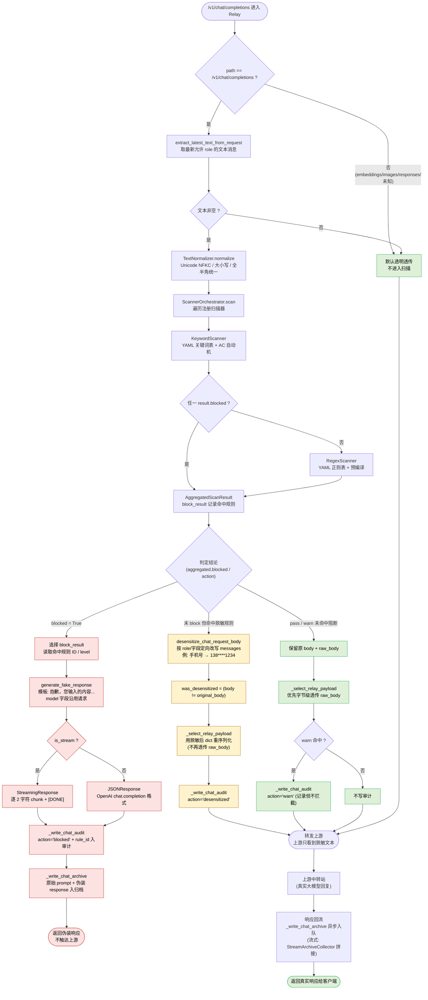

# B. 安全检测与处置决策流（block / desensitize / pass）

> 视角：Chat Completions 请求进入 Scanner 后，如何决定拦截伪装、脱敏改写或透明透传。
> 对应代码：`engine/scanner.py`、`engine/normalizer.py`、`engine/rules_keyword.py`、`engine/rules_regex.py`、`engine/models.py`、`proxy/relay.py`、`proxy/fake_response.py`。

## 决策口径（与 `_action_from_scan_result` 一致）

| 输入 | 输出 action | 是否触达上游 | 是否写审计 |
|------|-------------|--------------|------------|
| `scan_result.blocked == True` | `blocked` | 否（伪装回复） | 是 |
| 未 block 但 body 被改写 | `desensitized` | 是（发送脱敏后文本） | 是 |
| 未命中或 warn | `passed` / `warn` | 是（字节级透传 raw_body） | warn 写，pass 不写 |
| 非 Chat 接口 / 文本为空 | `passed` | 是 | 否 |

## 关键约束（与代码一致）

- **F2-C1**：伪装回复完全兼容当前请求的 OpenAI 响应格式（含流式 chunk 形态）。
- **F2-C2**：伪装内容不泄露具体规则名与命中片段。
- **F2-C4**：伪装回复的 `model` 字段沿用用户请求的 `model`。
- **F1-C11**：仅 Chat Completions 必走 Scanner，其他 `/v1/*` 默认透传。
- **优先级**：关键词命中 block 后直接短路，不再跑后续正则扫描器（`ScannerOrchestrator.scan` 中 `if any(blocked): return`）。
