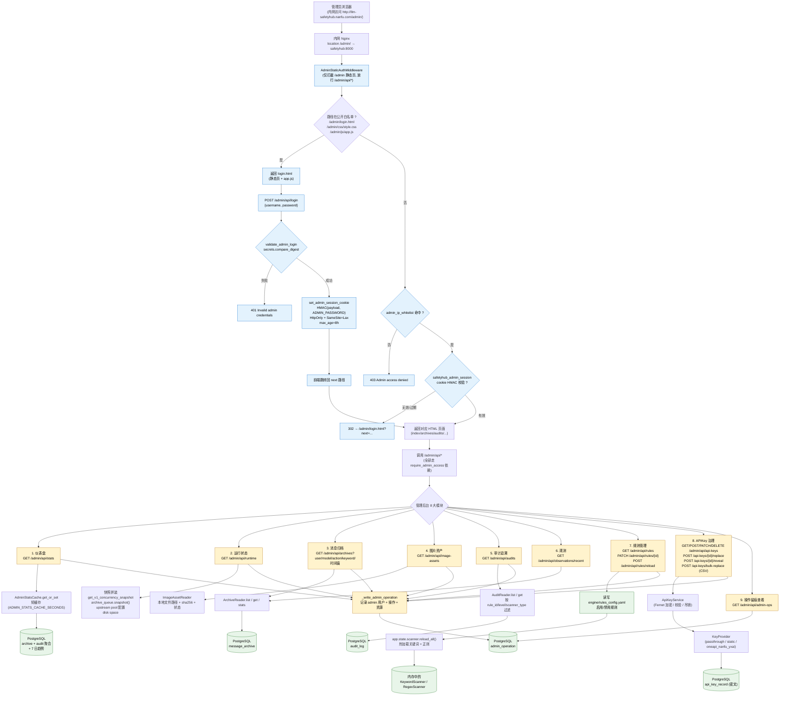

# C. 管理员管理逻辑（后台全景）

> 视角：管理员从浏览器登录到操作各功能模块的完整链路。
> 对应代码：`admin/router.py`、`admin/static/*.html`、`middleware/auth.py`、`storage/admin_ops.py`、`storage/archive.py`、`storage/audit.py`、`engine/rules_config.yaml`。

## 关键约束（与代码一致）

- **登录态**：`safetyhub_admin_session` cookie = `username:issued_at:HMAC-SHA256(payload, ADMIN_PASSWORD)`，最长 8h，HttpOnly，生产环境强制 Secure（`active_settings.is_production`）。
- **双通道认证**：cookie 失效时也可走 HTTP Basic（`WWW-Authenticate: Basic`），便于脚本/curl 访问。
- **IP 白名单**：`ADMIN_IP_WHITELIST` 非空时强制校验，支持精确 IP 与 CIDR 网段。
- **/admin/api/* 全量受护**：`router = APIRouter(dependencies=[Depends(require_admin_access)])`，仅 `/login` 和 `/logout` 例外。
- **操作留痕**：除查询类只读接口外，所有写操作经 `_write_admin_operation` 落 `admin_operation` 表。
- **stats 短缓存**：避免高频刷新仪表盘时打爆 PostgreSQL。
