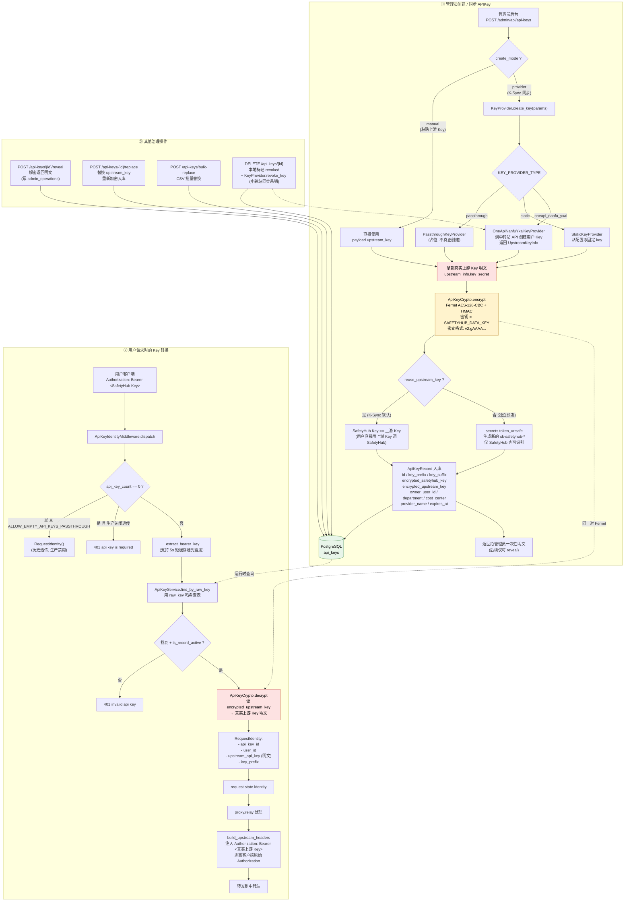

# D. APIKey 治理与上游 Key 替换流（K-Sync 机制）

> 视角：用户拿到的 SafetyHub Key 与最终打到中转站的 Key 不是同一个，这套替换、加密、轮转、吊销是怎么做的。
> 对应代码：`governance/api_keys.py`、`governance/key_provider.py`、`governance/providers/*.py`、`middleware/identity.py`、`proxy/relay.py`。

## 关键约束（与代码一致）

- **永不明文落库**：`encrypted_upstream_key` 与 `encrypted_safetyhub_key` 均用 Fernet 加密，密文带 `v2:` 版本前缀，便于后续算法升级。
- **数据密钥来源**：`SAFETYHUB_DATA_KEY` 环境变量；生产启动时 `validate_startup_settings` 强校验非空。
- **K-Sync 默认**：`reuse_upstream_key=True` 时 SafetyHub Key 直接等于上游 Key，对用户无感切换；`False` 时颁发独立 `sk-safetyhub-*`。
- **运行时性能**：Identity 中间件维护 `api_key_count` 短缓存（默认 5s），避免每次请求都打 DB 计数。
- **明文流向单向**：上游 Key 明文只在「创建/replace 接收 → 加密落库」与「中间件读取 → 立即注入 Authorization → 转发上游」两个瞬间存在，不会出现在日志、归档、审计中。
- **吊销同步**：`DELETE` 既本地标记 revoked，也调用 `KeyProvider.revoke_key` 通知中转站，避免外部 Key 残留。
