# E. 内网部署与整体通信拓扑

> 视角：SafetyHub 部署到南孚内网服务器后，办公网员工 → 前哨站 → 中转站 → 各 LLM 厂商的完整通信路径与端口、容器、网段关系。
> 对应文件：`docker-compose.yml`、`nginx/nginx.conf`、`Dockerfile`、`交付运行手册/内网服务器部署说明.md`、`docker离线部署/scripts/install.sh`。

```mermaid
flowchart LR
    %% ==================== 办公网区 ====================
    subgraph Office["南孚办公网"]
        direction TB
        Emp1["员工 A<br/>OpenClaw 桌面客户端"]
        Emp2["员工 B<br/>Hermes Web"]
        Emp3["员工 C<br/>标注 Agent / SDK"]
        AdminPC["管理员 PC<br/>(浏览器)"]
    end

    %% ==================== 内网服务器 ====================
    subgraph Server["内网服务器 (单机, Docker Compose)"]
        direction TB

        subgraph Network["Docker bridge 网络: safetyhub_default"]
            direction TB

            subgraph NginxBox["容器: safetyhub-nginx (nginx:1.27-alpine)"]
                NginxSrv["Nginx<br/>listen 80<br/>server_name llm-safetyhub.nanfu.com<br/>upstream safetyhub:8000 keepalive=1024<br/>proxy_buffering off (SSE)"]
            end

            subgraph AppBox["容器: safetyhub-app (FastAPI + uvicorn)"]
                App["uvicorn main:app<br/>--workers ${UVICORN_WORKERS:-4}<br/>--proxy-headers --forwarded-allow-ips=${UVICORN_FORWARDED_ALLOW_IPS:-*}<br/>expose 8000"]
                AppRoutes["路由:<br/>/health/* (健康检查)<br/>/v1/* (OpenAI 代理)<br/>/admin/* + /admin/api/*<br/>(全部走中间件链)"]
                AppState["app.state:<br/>scanner / archive_queue<br/>upstream_client (共享 httpx)<br/>api_key_service / key_provider<br/>admin_stats_cache"]
                App --> AppRoutes --> AppState
            end

            subgraph DBBox["容器: safetyhub-postgres (postgres:16-alpine)"]
                PG["PostgreSQL 5432<br/>asyncpg + SQLAlchemy<br/>healthcheck: pg_isready"]
                PGTables[("表:<br/>training_conversations<br/>runtime_settings<br/>data_governance_jobs<br/>audit_logs<br/>image_assets<br/>api_keys<br/>approval_requests<br/>security_policies<br/>approval_chains<br/>admin_operations")]
                PG --> PGTables
            end
        end

        subgraph Volumes["宿主机挂载卷"]
            VolPG["${SAFETYHUB_POSTGRES_DATA_DIR}<br/>→ /var/lib/postgresql/data"]
            VolApp["${SAFETYHUB_DATA_DIR}<br/>→ /app/data<br/>(图片资产 / 临时文件)"]
            VolRules["engine/rules_config.yaml<br/>(只读挂载, 支持热加载)"]
            VolNginx["nginx/nginx.conf<br/>(只读挂载)"]
        end

        Volumes -.-> NginxBox
        Volumes -.-> AppBox
        Volumes -.-> DBBox
    end

    %% ==================== 外部出网 ====================
    subgraph Outbound["公网出口 (经企业网关)"]
        Relay1["中转站: OneAPI (内部部署)"]
        Relay2["中转站: 南孚 YXAI (OneApiNanfuYxaiKeyProvider)"]
    end

    subgraph Vendors["LLM 厂商"]
        V1["OpenAI"]
        V2["Anthropic"]
        V3["DeepSeek / 通义 / 文心 / ..."]
    end

    %% ==================== 通信链路 ====================
    Emp1 -->|"HTTPS/HTTP<br/>Bearer SafetyHub Key<br/>/v1/chat/completions (SSE)"| NginxSrv
    Emp2 -->|"/v1/embeddings"| NginxSrv
    Emp3 -->|"/v1/images/generations"| NginxSrv
    AdminPC -->|"/admin/ + cookie 鉴权<br/>(可选 ADMIN_IP_WHITELIST)"| NginxSrv

    NginxSrv -->|"keepalive 1024<br/>X-Request-ID / X-Forwarded-*"| App
    App <-->|"asyncpg 连接池"| PG
    App -->|"httpx 共享连接池<br/>UPSTREAM_MAX_CONNECTIONS=200<br/>替换为真实上游 Key"| Relay1
    App -->|"httpx 共享连接池"| Relay2

    Relay1 -->|"按模型分发"| V1
    Relay1 --> V2
    Relay2 -->|"K-Sync 颁发的<br/>租户子 Key"| V3
    Relay2 --> V1

    %% ==================== 响应回流 ====================
    V1 -. "SSE / JSON 回流" .-> Relay1
    Relay1 -. "逐 chunk" .-> App
    App -. "_write_chat_archive 异步入队<br/>不阻塞响应" .-> PG
    App -. "X-Accel-Buffering: no" .-> NginxSrv
    NginxSrv -. "实时流式回客户端" .-> Emp1

    classDef office fill:#e3f2fd,stroke:#1976d2,color:#000
    classDef ngx fill:#fff3cd,stroke:#b7791f,color:#000
    classDef app fill:#dff0d8,stroke:#27ae60,color:#000
    classDef db fill:#fde2e2,stroke:#c0392b,color:#000
    classDef ext fill:#ede7f6,stroke:#5e35b1,color:#000
    class Emp1,Emp2,Emp3,AdminPC office
    class NginxSrv,NginxBox ngx
    class App,AppRoutes,AppState,AppBox app
    class PG,PGTables,DBBox db
    class Relay1,Relay2,V1,V2,V3 ext
```

## 端口与暴露面（生产口径）

| 角色 | 监听 | 暴露给 | 说明 |
|------|------|--------|------|
| Nginx | 宿主机 `${SAFETYHUB_HTTP_PORT:-80}:80` | 办公网 | 唯一对外入口 |
| SafetyHub | 容器内 8000 | 仅 docker 网络（`expose`） | 不直接暴露宿主机 |
| PostgreSQL | 容器内 5432 | 仅 docker 网络 | 数据不出容器网络 |

## 关键路径（与 `nginx.conf` 一致）

- `/v1/*` → `proxy_buffering off / proxy_request_buffering off / gzip off / X-Accel-Buffering no` → 保证 SSE 流式逐 chunk 实时透传。
- `/admin/*` → 普通反代，透传 `X-Forwarded-Proto` 让 SafetyHub 判定 https，再下发 `Secure` cookie。
- `/health/*` → 仅探活，不进入 `/v1/*` 并发队列。
- `location = /` → `302 /admin/`，方便管理员直接访问根域名。

## 关键流量特征

- **客户端 → Nginx**：用 SafetyHub 颁发的 Bearer Key（K-Sync 默认与上游 Key 同值）。
- **App → 中转站**：用 `RequestIdentity.upstream_api_key`（已解密）替换 Authorization，客户端原始 Authorization 不会出网。
- **响应回流**：上游 → App 后立即流回客户端；训练样本、审计证据和图片资产通过异步链路落 PostgreSQL，不阻塞主链路。
- **管理员通道独立**：`/admin/*` 不进入 `/v1/*` 并发队列，压测期间仍可访问后台。
- **可选 IP 白名单**：`ADMIN_IP_WHITELIST` 可只放行 IT 管理员网段访问 `/admin/`。

## 离线部署形态

内网无外网时通过 `docker离线部署/scripts/install.sh` 安装：

1. `docker-offline-deploy_*.tar.gz` 内含 Docker + Compose 二进制、systemd 单元、`safetyhub_intranet_bundle_*.tar.gz`。
2. `install.sh` 安装 Docker 引擎 → 解压应用离线包 → `docker load` SafetyHub/PostgreSQL/Nginx 镜像 → 启动 PostgreSQL。
3. 应用部署脚本执行 `scripts/rebuild_runtime_tables_preserve_apikeys.py`：重建业务表前，先用 `pg_dump` 把现有 `api_keys` 表备份到持久化数据盘（备份失败则中止部署）；保留内网已有 `api_keys` 表，不从 JSON/SQL 重新导入 APIKey；删除并重建当前系统需要的其他表。
4. 启动 SafetyHub 和 Nginx；SafetyHub 仅需出网到企业内部的中转站（OneAPI / YXAI），不需要直连 OpenAI。
