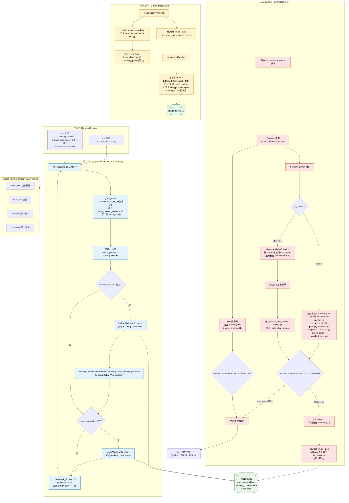

# F. 数据异步归档与削峰流（落库链路）

> 视角：为什么归档/审计/图片资产写入不会拖慢用户的 `/v1/*` 请求，数据最终是怎么落到 PostgreSQL 的。
> 对应代码：`runtime/archive_queue.py`、`storage/archive.py`、`storage/audit.py`、`storage/image_assets.py`、`storage/training.py`、`storage/data_governance.py`、`proxy/relay.py`。

## 关键参数（与 `config.py` 一致）

| 参数 | 默认 | 作用 |
|------|------|------|
| `ARCHIVE_QUEUE_MAX_SIZE` | 5000 | 内存队列上限，超过即 `dropped` |
| `ARCHIVE_BATCH_SIZE` | 50 | 单次 bulk insert 大小 |
| `ARCHIVE_FLUSH_INTERVAL_SECONDS` | 1 | 攒不满批时的最大等待 |
| `ARCHIVE_MAX_PAYLOAD_BYTES` | 262144 | 单条 payload 上限 |
| `STREAM_ARCHIVE_MAX_BYTES` | 见 settings | 流式响应归档截断阈值 |

## 关键设计要点（与代码一致）

- **三段分离**：① Relay 同步组装 payload（CPU 操作，毫秒级）→ ② 投递内存 Queue（`put_nowait`，无阻塞）→ ③ 后台 worker 批量 flush（IO 操作，与主链路解耦）。
- **背压策略**：队列满直接 `dropped += 1`，再 fallback 用 `asyncio.create_task` 尝试一次直写，**不阻塞**用户请求；丢弃数通过 `/admin/api/runtime` 暴露。
- **流式归档**：`StreamArchiveCollector` 不缓存完整响应给用户，只另存一份截断副本到归档，**逐 chunk 仍实时透传给客户端**。
- **批量写入**：`write_many` 用 SQLAlchemy bulk insert，把多次 commit 合并成一次，显著降低 PostgreSQL 压力。
- **训练数据派生**：归档批量写入后，`TrainingConversationWriter` 仅从 `passed` 且未 block 的 Chat 归档派生 `training_conversations`，形成 messages + assistant response 的确定性 `trajectory`，供数据治理覆盖分析和清理使用。
- **优雅关闭**：`stop()` 先 `await queue.join()` 等积压排空再 cancel worker，避免丢数据。
- **图片本体独立异步**：图片下载/解码是慢操作，单独走 `asyncio.create_task` + `ImageAssetArchiver`，不进归档队列，避免拖累文本归档批次。
