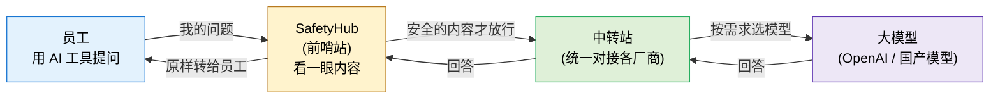

# S1. 一句话看懂 SafetyHub 在干嘛

> 给非研发同事的开场图。一张图说清"前哨站"在整条 AI 调用链里站在哪一格。

## 一句话理解

> **SafetyHub 就是公司给 AI 调用加的一道"安全门岗"——员工和大模型之间所有的话，都得先从这里过一道。**

## 它做了三件事

1. **看内容** —— 提问里有没有敏感信息（手机号、客户名、机密项目代号…）
2. **管钥匙** —— 员工不直接拿大模型的 Key，前哨站统一保管和替换
3. **存档案** —— 每一次对话都留底，事后可以查、可以审
