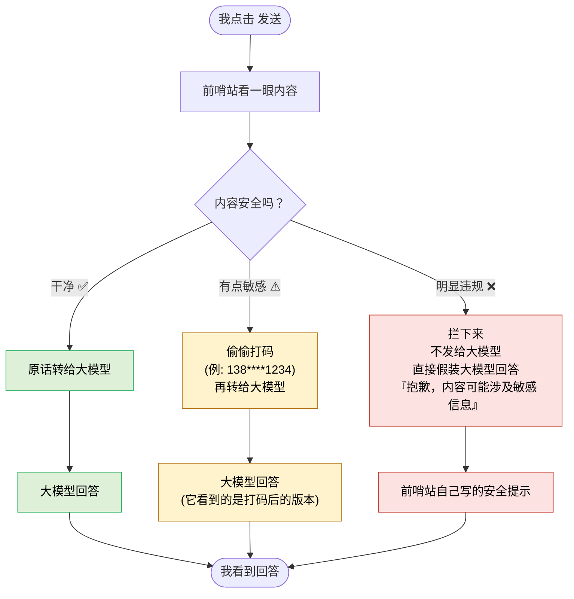

# S2. 一次对话发生了什么（用户视角）

> 我点一下"发送"，背后到底走了什么流程。

## 三种结局对照

| 结局 | 我感受到的 | 实际发生的 |
|------|-----------|-----------|
| ✅ 通过 | 和直接用 ChatGPT 一样 | 内容原样转出去 |
| ⚠️ 脱敏 | 和平时一样收到回答 | 大模型其实只看到了打码版 |
| ❌ 拦截 | 收到一段"抱歉..."的回答 | 大模型其实**根本没看到这次提问** |
