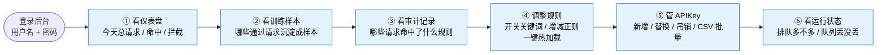

# S3. 管理员一天的操作

> 管理员上班后会做什么——按从轻到重的顺序串起来。

## 每一步在解决什么

| 步骤 | 解决的问题 |
|------|-----------|
| ① 仪表盘 | 今天系统忙不忙、有没有异常 |
| ② 训练样本 | 查看通过请求是否形成可用的 messages + assistant response；被拦截和脱敏证据看审计 |
| ③ 审计 | 看到底是哪条规则在拦人，是不是误伤 |
| ④ 规则 | 误伤了就放宽，漏了就收紧，**改完立即生效，不用重启** |
| ⑤ APIKey | 员工入职/离职、Key 泄露时快速处理 |
| ⑥ 运行状态 | 压力大不大、要不要扩容 |
