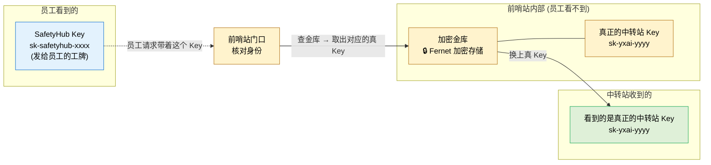

# S4. APIKey 的一进一出

> 为什么员工拿到的 Key 和真正打到中转站的 Key 不是同一个——这件事一张图说清。

## 为什么要这么绕

| 场景 | 好处 |
|------|------|
| 员工离职 | 后台一键吊销他的 Key，不影响别人 |
| Key 泄露 | 只需替换"真 Key"，员工那张工牌不用换 |
| 成本分摊 | 每个 Key 绑定部门/成本中心，账单可以拆 |
| 安全审计 | 真 Key 永远只在内存里出现一瞬间，落库和日志都是密文 |

## 一个比喻

> SafetyHub Key 像**公司给员工的门禁卡**——刷一下就能用。
> 中转站 Key 像**大楼真正的物理钥匙**——锁在保险柜里，门禁系统替员工去开门。
> 员工根本不需要知道真钥匙长什么样。
