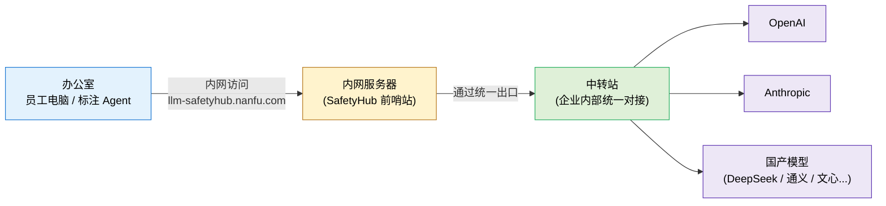

# S5. 部署在哪里、流量怎么走（极简拓扑）

> 公司装了这套系统之后，一次 AI 调用的流量到底走了哪些地方。

## 几个关键事实

- **员工电脑不直连大模型** —— 直接访问 OpenAI 的网络包根本出不去。
- **前哨站装在公司内网服务器上** —— 一个域名，所有 AI 工具都指向这里。
- **统一出口** —— 出公网的事情交给中转站做，前哨站只管"看内容 + 换 Key + 存档"。
- **想换模型？** —— 改前哨站的配置即可，员工那边完全无感。
