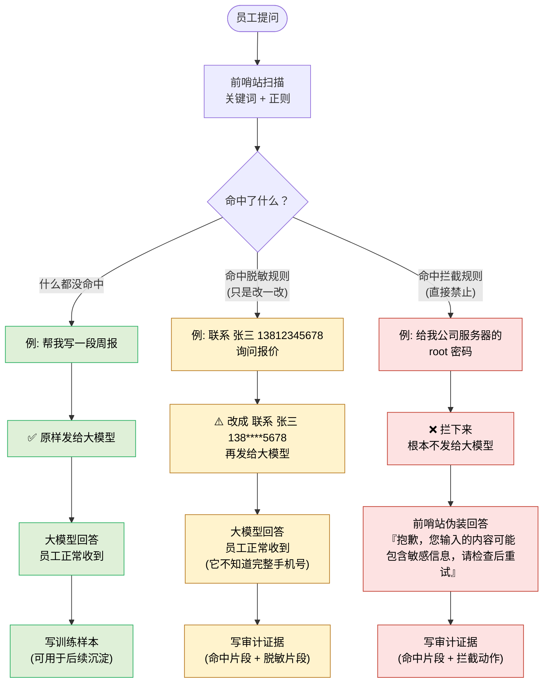

# S6. 命中敏感词后会怎样（三结局示意图）

> 同一句话，根据内容会有三种不同的命运。用例子讲清楚。

## 三个结局的差异

| 维度 | ✅ 通过 | ⚠️ 脱敏 | ❌ 拦截 |
|------|---------|---------|---------|
| 大模型看到的 | 原话 | 打码版 | 什么都没看到 |
| 员工感受 | 正常回答 | 正常回答 | 收到安全提示 |
| 是否触达上游 | 是 | 是 | **否** |
| 是否留档 | 不留 | 留：原文 + 脱敏版 | 留：原文 + 伪装回答 |

## 误伤了怎么办

管理员在后台 **规则页面** 关闭那条规则 → 一键热加载 → 立即生效。
