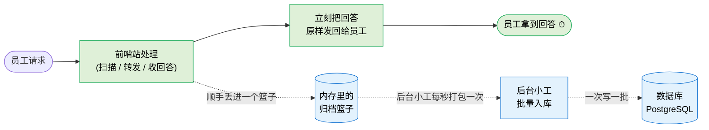

# S7. 数据是怎么存下来的（一句话版）

> 为什么"存档"不会让员工感觉变慢——一张图说清。

## 一句话

> **员工的回答先走，数据存档由后台慢慢做——员工感觉不到任何延迟。**

## 三个保护设计

| 场景 | 设计 |
|------|------|
| 高峰期请求暴涨 | 篮子有容量上限，满了就丢一部分（保住用户体验），并在后台看板可见"丢弃数" |
| 后台写库失败 | 不影响员工请求，只是这一批数据落不了，会被记录 |
| 系统重启 | 关闭前先等篮子排空再退出，避免丢数据 |

## 为什么要这么设计

如果让"存档"和"回答员工"串在一起做，数据库一卡顿，员工就觉得 AI 卡了。
现在拆成两条路：**主路只管回答，存档走副路。**
